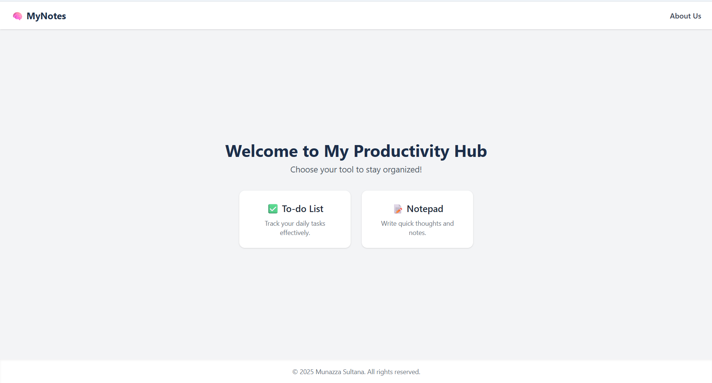
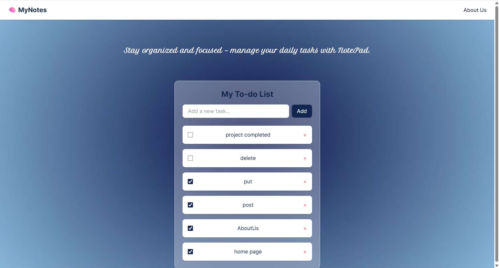
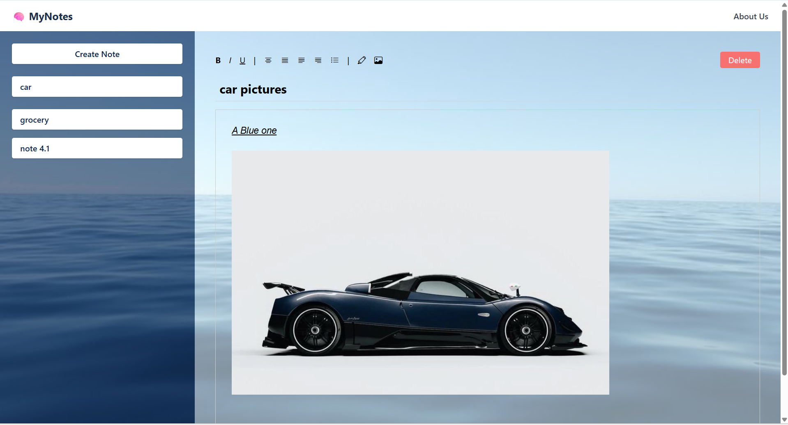
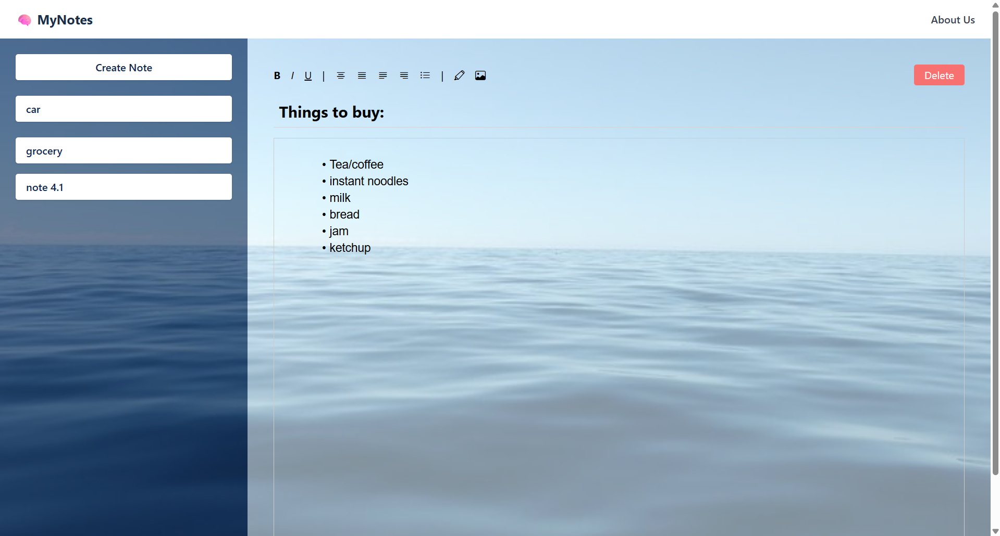
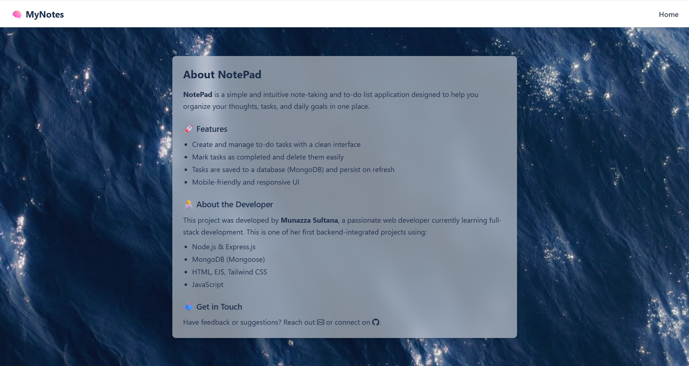

# 🧠 Notepad Web App

A rich-text notepad and todo web application built with Quill.js, Express.js, MongoDB, and Tailwind CSS.
The application consists of two main sections: a Note-taking app with rich-text formatting (including images, bold, italic, etc.) and a To-do list for task management. The frontend was designed with the help of AI-generated layouts for an enhanced user experience. Users can seamlessly create, edit, delete, and persist both notes and todos.
## ✨ Features

- Create new notes with editable titles
- Rich-text editor using Quill.js
- Supports images, lists, bold, italic, underline, and alignment
- Notes saved in MongoDB using Mongoose
- Delete notes from both UI and database
- Responsive and clean UI with Tailwind CSS

## 🚀 Tech Stack

- **Frontend**: HTML, Tailwind CSS, JavaScript, Quill.js
- **Backend**: Node.js, Express.js
- **Database**: MongoDB Atlas

## 📸 Screenshot

### 📌 Home Page


### 📌 Todo Page


### 📌 note Page


### 📌 note Page


### 📌 about Page


## 🛠️ Setup Instructions

```bash
git clone https://github.com/Munazz-a/notepad-app.git
cd notepad-app
npm install
npm start


📌 Status
✅ Completed basic features
⬜ Planned: Add export to PDF, login support

📄 License
This project is licensed under the MIT License.
